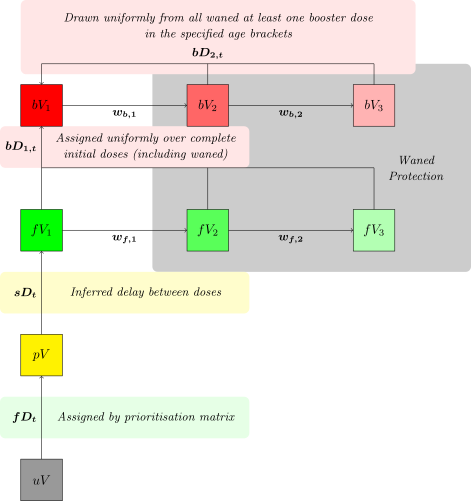
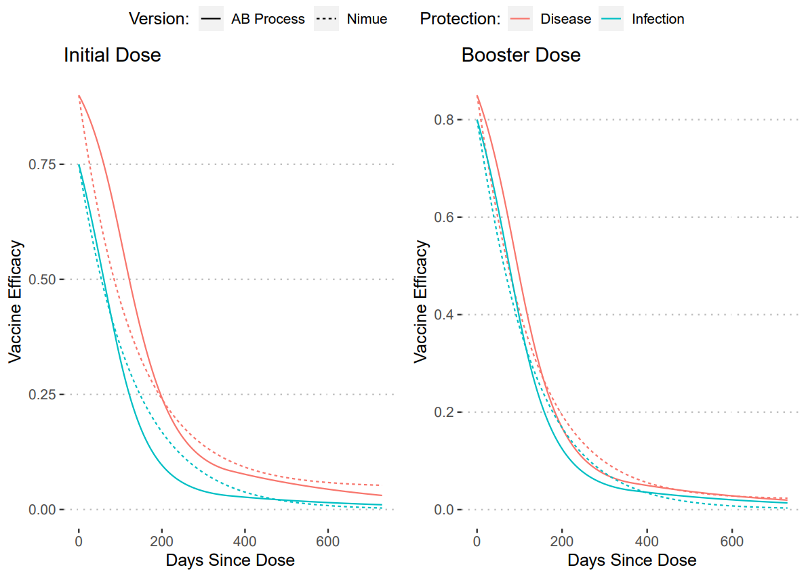

```{r, include = FALSE}
knitr::opts_chunk$set(
  collapse = TRUE,
  comment = "#>"
)
library(tidyr)
library(dplyr)
library(ggplot2)
library(squire.page)
```

This vingette describes the rewritten *nimue* booster pathway. This update 
allows the inclusion of booster doses to vaccination campaigns in the *nimue* 
model and allows explicit inclusion of first and second doses. No changes are 
made to the infection and hospitalisation pathway.

# Model Structure

```{r out.width="400px", fig.align = "center", echo=F}

```

Compartment definitions are as follows:

* $uV$ Un-vaccinated population,
* $pV_i$ Partially vaccinated/protected population (i.e. first dose of a two dose regimen),
* $fV_i$ Fully vaccinated/protected population (i.e. both doses of a two dose regimen).
Partial and full dose compartments both feed into waned compartments that represent reduced vaccine efficacy over time.
Transition rates are defined as:
* $fD_t$ Daily time-series of first doses,
* $sD_t$ Daily time-series of second doses,
* $bD_t$ Daily time-series of booster doses,
* $w_p$ Rate of waning of first dose protection,
* $w_i$ Rate of waning of second/boosted dose protection.

# Usage

The user is expected to provide a time-series of first, second, and booster doses.
This model is primarily for usage in the *global_lmic_reports*, and so it not
intended for normal usage. The objects necessary for MCMC fitting can be access
as so:

```{r, eval=FALSE}
#model object
squire.page::nimue_booster_model()
#likelihood function
squire.page::calc_loglikelihood_booster()
#pmcmc object
squire.page::pmcmc_drjacoby(log_likelihood = squire.page::calc_loglikelihood_booster,
                            nimue_booster_model = squire.page::nimue_booster_model,
                            ... #specific arguments here)
```

The model can be run as in *squire* or *nimue* with the non-exported function 
`squire.page:::run_booster`.

```{r fig.width=7,fig.height=5}
squire.page:::run_booster(
  country = "United Kingdom",
  first_doses = c(100, 1000, 500),
  tt_first_doses = c(0, 10, 50),
  second_doses = c(0, 1000),
  tt_second_doses = c(0, 30),
  booster_doses = c(0, 1000),
  tt_booster_doses = c(0, 200)
) %>% 
  squire.page::nimue_format(var_select = c("vaccinated_first_dose", "vaccinated_first_waned", "vaccinated_second_dose", "vaccinated_second_waned")) %>% 
  tibble() %>% 
  pivot_wider(names_from = compartment, values_from = y) %>% 
  transmute(
    t = t,
    `Waned (Full Dose)` = vaccinated_second_waned,
    `Fully Protected` = vaccinated_second_dose - vaccinated_second_waned,
    `Waned (Partial Dose)` = vaccinated_first_waned,
    `Partially Protected` = vaccinated_first_dose - vaccinated_first_waned
  ) %>%
  pivot_longer(c(`Waned (Full Dose)`, `Waned (Partial Dose)`, `Fully Protected`, `Partially Protected`),
               names_to = "Vaccine Protection", values_to = "Population") %>% 
  ggplot(aes(x = t, y = `Population`, colour = `Vaccine Protection`)) + 
  geom_line()
```

As the delay in development of vaccination protection is removed, the time-series
for first/second doses provided to the model if internally adjusted via an Erlang
distribution with shape 2 and rate 1/14 to simulate this effect.

To simulate a primary single dose vaccine (i.e. Janssen) set both first and second
dose efficacies to the same desired level and set the time-series of the second doses
to the time-series of first doses delayed by a day.

# Limitations

Note that this framework assumes that a booster dose restores vaccine protection
to the same level, this is a simplification and cannot capture any increase in 
protection. Hence this framework is not suited to modelling a booster dose of
a different vaccine to primary series. This also means that the framework cannot
capture any increase in protection longevity from a booster dose nor the
interaction between boosters and variants.

# Parameterisation

Default parameter values are chosen to be representative for the vaccination 
programmes of LMIC and LIC countries and against the wild-type variant and as 
such represent no single vaccine but are chosen from a range of values to
represent roughly the Adenovirus, Whole Virus, and Subunit vaccines.
Note that for work involving these efficacies against Delta and Omicron are 
calculated elsewhere.

Vaccine Efficacies:

```{r, include=FALSE}
tribble(
  ~`Compartment`, ~`Protection Against Disease`, ~`Protection Against Infection`,
  "~pV_1~", 0.75, 0.55,
  "~pV_2~", 0.01628344, 0.00000000,
  "~fV_1~", 0.90, 0.75,
  "~fV_2~", 0.90, 0.100744678,
  "~fV_3~", 0.034275872, 0.002989531
) %>% 
  knitr::kable()
```

Waning Rates:

* $w_p$ = 0.01015148 (98.5 days)
* $w_1$ = 0.009757324 (102.5 days)
* $w_2$ = 0.019463164 (51.4 days)

To calculate these values we utilised an approach taken previously looking at
waning vaccine efficacy via AB titres ([Report 48](https://www.imperial.ac.uk/mrc-global-infectious-disease-analysis/covid-19/report-48-global-omicron/)). We took our assumed 
non-waned efficacies and then created an median waning curve from these values.
Then we fit the waning rates and waned compartment values to recreate these curves.
The plots of these fits are shown below.

```{r out.width="600px", fig.align = "center", echo=F}

```
