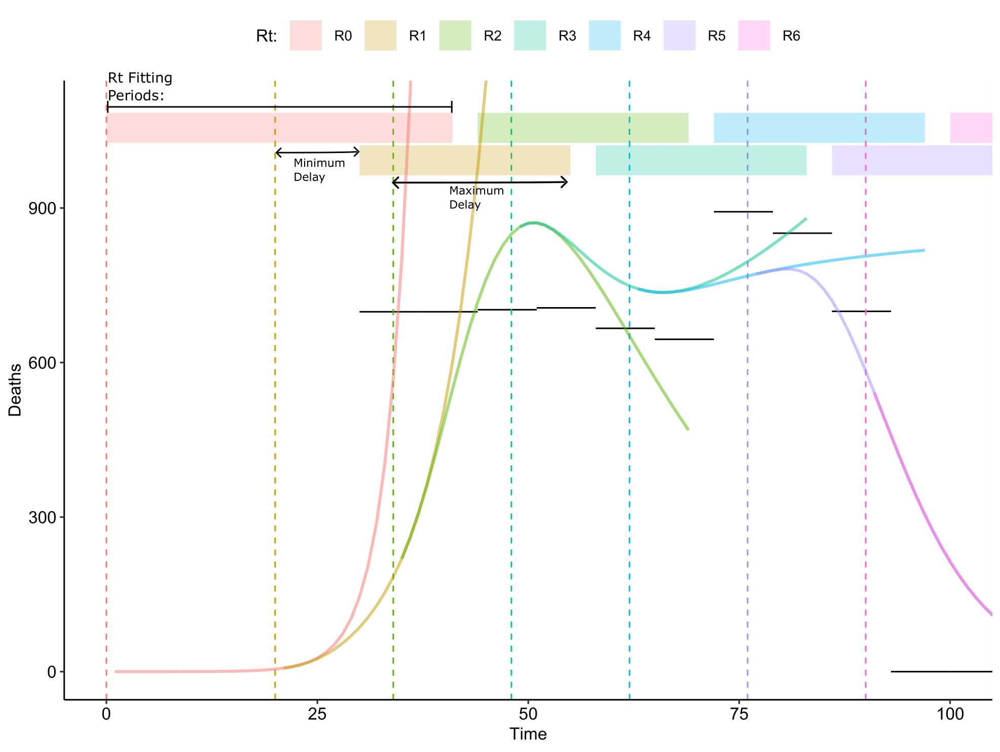

```{r, include = FALSE}
knitr::opts_chunk$set(
  collapse = TRUE,
  comment = "#>"
)
library(tidyr)
library(dplyr)
library(ggplot2)
library(squire.page)
```

This vignette describes the new fitting method where we optimise the $R_t$ values 
for a set of given parameters.

# Method Outline

## Descriptive

Inputs are assumed to be a set of distributions for the non $R_t$ parameters and
a set of deaths that occur over set time periods, so $D_i$ deaths occur over the
time period $[t_{f,i}, t_{s,i}]$ for each $i \in 1$ to $T_D$. We assume that the
epidemic begins at time 0. We define our parameters to vary in the fitting 
process as $\boldsymbol{R} = \{R_t;\ t\in 0\mathrm{\ to\ }T_R\}$. Each $R_t$ to 
comes into effect at time $t_{R_t}$, by default this every 14 days with 
$T_R = T_D - \max{\boldsymbol{\lambda}}$.

1. Generate $N$ samples from our assumed distributions on our non $R_t$ 
parameters.
This will be discussed more in the section on *Parameter Uncertainty*.
2. Determine which deaths will be used to fit each $R_t$. Using the structure of
the model we calculate the average time from infection to death (given death is 
the outcome). This should match the delay between the $R_t$ value changing and 
its effect on the modelled deaths. This value depends on the duration parameters
given to the model and on the number of hospital or ICU beds available, hence we
determine all 4 possible durations, $\boldsymbol{\lambda}$.
We define the relevant deaths for an $R_t$ by choosing all deaths that lie 
within widest possible window that our $R_t$ value could directly effect, meaning
any death that has its entire time period occur within the bounds
$[t_{R_t} + \min(\boldsymbol{\lambda}), t_{R_{t+1}} + \max(\boldsymbol{\lambda})]$.
    1. For $R_0$ we set the bounds to $[0, t_{R_{1}} + \max(\boldsymbol{\lambda})]$,
    and for $R_{T_R}$ we set the bounds to ${t_{R_{T_R}} + \min(\boldsymbol{\lambda}), t_{s,T_D}}$.
    2. For simplity we will define $\boldsymbol{i_{R_t}} = \{i;\ t_{s,i} \geq t_{R_t} + \min(\boldsymbol{\lambda})\ \&\ t_{f,i} \leq \max(\boldsymbol{\lambda})\}$, which is the indexes of all deaths that occur within
    $R_t$'s fitting period
3. For each distinct sample from the parameter distributions:
    1. Begin the estimation procedure by estimating $R_0$ and $I_0$, the 
    initial number of infections. $I_0$ is uniformly spread across the unvaccinated
    working age population.
    2. When optimising $R_t$ we set upper and lower bounds on the values it can
    take, which will be the hyper parameters $\alpha, \beta$ with $\alpha > \beta$
    and $\alpha = 10, \beta = 0.5$ by default. To optimise $I_0$ we split a given
    range of numbers into $N_p$ values, which we'll call $P_{I_0}$.
    3. To find our optimal values for $R_0$ and $I_0$ we optimise the log-likelihoods
    for each element of $P_{I_0}$ in terms of $R_t$ using the *Brent* optmisation method.
    The likelihood uses the negative binomial 
    distribution with a mean equal to the modelled deaths and $k$ a user defined 
    dispersion parameter on $D_i$, the deaths that fall within $R_0$ fitting window 
    as per *step 2*. We then take the $I_0$ and $R_t$ which the highest optimised 
    likelihood as our values for $R_0$ and $I_0$.
    4. Using $R_0$ and $I_0$ we calculate the state of the models compartments
    at time $t_{R_1}$, which we will call $\boldsymbol{I_{R_1}}$.
    5. For each $R_t \in \boldsymbol{R}/R_0$:
        1. Choose $R_t$ by optimising the log-likelihood over all $D_i$ such that $i \in i_{R_t}$
        2. With $R_t$ and $\boldsymbol{I_{R_t}}$ calculate $\boldsymbol{I_{R_{t+1}}}$
        which occurs at time $t_{R_t + 1}$.
4. Should end up with a set $\boldsymbol{R}$ for each sample such that modelled 
deaths are similar to the observed deaths.

## Mathematical

Let $\boldsymbol{p}$ be a set of non-$R_t$ model parameters.
Then let $m_{I}(\boldsymbol{p}, \boldsymbol{I_{R_{t}}}, R_t, t)$ be a function that returns the model
state at time $t$, given the state of the model when $R_{t+1}$ comes into effect,
and $m_{d}(\boldsymbol{p}, \boldsymbol{I_{R_t}}, R_t, t_s, t_f)$ be a function that 
produces the number of deaths in the model occuring over time period $[t_s, t_f]$.


For each $\boldsymbol{p}$:

1. $$
\{R_0, I_0\} = \mathrm{argmax}_{x,y \in [\alpha, \beta] \times \boldsymbol{P_{I_0}}}\left(
  \prod_{i \in \boldsymbol{i_{R_0}}}\frac{\Gamma(D_i + n_i)}{\Gamma(n_i)D_i!}(1-p_i)^{D_i}p_i^{n_i}
\right),
$$
where:
$$
p_i = \frac{k}{k + \mu_i},\ n_i = \frac{p_i \times \mu_i}{1-p_i} ,\ \ \mu_i =  m_d(\boldsymbol{p}, y, x, t_{s,i}, t_{f,i}).
$$
2. $\boldsymbol{I_{R_1}} = m_I(\boldsymbol{p}, I_0, R_0, t_{R_1})$, note that we
treat $I_0$ and $\boldsymbol{I_{R_0}}$ interchangeably here.
3. For each element of $\{t; t>0\ \&\ R_t \in [\alpha, \beta]\}$
    1. $$
    R_t = \mathrm{argmax}_{x \in \boldsymbol{P_{R_t}}}\left(
    \prod_{i \in \boldsymbol{i_{R_t}}}\frac{\Gamma(D_i + n_i)}{\Gamma(n_i)D_i!}(1-p_i)^{D_i}p_i^{n_i} \right)
    $$
    where:
    $$
    p_i = \frac{k}{k + \mu_i},\ \ n_i = \frac{p_i \times \mu_i}{1-p_i},\ \ \mu_i =  m_d(\boldsymbol{p}, \boldsymbol{I_{R_t}}, x, t_{s,i}, t_{f,i}).
    $$
    2. $\boldsymbol{I_{R_{t+1}}} = m_I(\boldsymbol{p}, \boldsymbol{I_{R_{t}}}, R_t, t_{R_{t+1}})$

## Diagram

```{r out.width="600px", fig.align = "center", echo=F}

```

In this diagram, the black lines represent the estimate excess mortality data
and the coloured lines are the deaths produced by the chosen for each $R_t$.

# Parameter Uncertainty

It is up to the user to setup the distributions on their parameters or just 
pass the function and set of parameters they like.

In the *lmic_reports* these are drawn from distributions representative of the
epidemic, please see the [methods page](https://mrc-ide.github.io/global-lmic-reports/parameters.html).

# Limitations

It is necessary to bound $R_t$ above and below certain thresholds to avoid dramatically
high or low changes. So far all fits seem to work well with $R_t$ ranges around
$0.5$ or $0.9$ to $10$, though it is possible for there be a curve that cannot
be matched with this algorithm on simple bounds.
